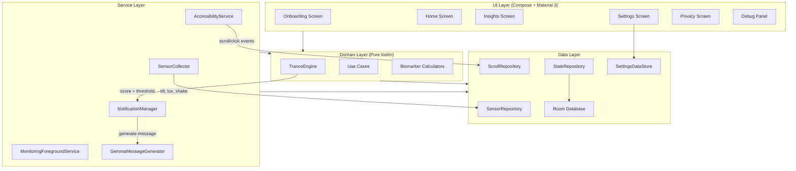

# ZombieThumb — Architecture & Implementation Plan

## Overview

ZombieThumb is a privacy-first, fully on-device Android app that detects "doomscrolling" patterns using 4 biomarkers derived purely from interaction physics (swipe velocity, tap ratios, device tilt, ambient light) — **never** reading screen content. When a trance state is detected, it sends a compassionate notification generated by on-device Gemma 2B via MediaPipe.

---

## Architecture



### Package Structure

```
com.zombiethumb
├── data/
│   ├── accessibility/       # AccessibilityService, event models
│   ├── sensor/              # SensorCollector, tilt/light/shake
│   ├── db/                  # Room entities, DAOs, database
│   ├── datastore/           # DataStore preferences
│   └── repository/          # Repository implementations
├── domain/
│   ├── model/               # TranceScore, Biomarker, ScrollSession, etc.
│   ├── engine/              # TranceEngine (pure Kotlin, unit-tested)
│   ├── biomarker/           # Individual biomarker calculators
│   └── usecase/             # GetTranceScoreUseCase, GetInsightsUseCase, etc.
├── service/
│   ├── MonitoringService.kt # Foreground service orchestrator
│   ├── NotificationHelper.kt
│   └── GemmaMessageGenerator.kt
├── ui/
│   ├── theme/               # Colors, Typography, Theme
│   ├── onboarding/          # Onboarding flow
│   ├── home/                # Home screen + gauge
│   ├── insights/            # Weekly charts
│   ├── settings/            # Settings screen
│   ├── privacy/             # Privacy screen
│   ├── debug/               # Debug panel
│   └── navigation/          # NavHost, routes
└── di/                      # Manual DI (ServiceLocator) — no Hilt for simplicity
```

---

## Milestones

### Milestone 1: Project Scaffolding & Build System ✅ build gate
- Create Android project with Kotlin DSL Gradle, version catalog
- Configure min SDK 29, target SDK 34, Compose BOM, Material 3
- Add dependencies: Room, DataStore, Coroutines, MediaPipe genai
- Verify NO internet permission in manifest
- Create empty app shell with bottom nav (Home, Insights, Settings, Privacy)
- **Build gate**: `./gradlew assembleDebug` succeeds

### Milestone 2: Domain — TranceEngine & Biomarkers ✅ unit tests
- Implement 4 biomarker calculators as pure Kotlin classes:
  1. `FlickRhythmBiomarker` — sliding window variance + interval analysis
  2. `ConsumptionRatioBiomarker` — scroll vs. tap ratio
  3. `BedtimeSlumpBiomarker` — tilt angle + stillness + lux
  4. `FeedMileageBiomarker` — pixels → meters via DPI
- Implement `TranceEngine`:
  - Accepts event streams (scroll events, sensor readings)
  - Combines biomarkers with documented weights into 0-100% score
  - EMA smoothing
  - Configurable threshold with cooldown
- Unit tests with synthetic streams: reading, doomscrolling, bedtime
- **Test gate**: All unit tests pass

### Milestone 3: Data Layer — Room, DataStore, Repositories
- Room database: `ScrollSession`, `DailyStats`, `NotificationLog` entities
- DAOs for aggregated stats queries (weekly meters, peak hours, bedtime streak)
- DataStore for settings: threshold, cooldown, quiet hours, monitored apps, demo mode
- Repository interfaces in domain, implementations in data
- **Build gate**: `./gradlew assembleDebug` succeeds

### Milestone 4: Service Layer — Accessibility + Sensors + Foreground Service
- `ZombieAccessibilityService`:
  - `canRetrieveWindowContent="false"` in XML config
  - Listen only to TYPE_VIEW_SCROLLED, TYPE_VIEW_CLICKED, TYPE_WINDOW_STATE_CHANGED
  - Package allowlist filter
  - Extract scrollDeltaY, never read text
  - Emit events to repository via Flow
- `SensorCollector`:
  - TYPE_ACCELEROMETER, TYPE_GRAVITY, TYPE_LIGHT
  - Register only while monitored app is foreground, unregister otherwise
  - Compute tilt angle, micro-shake, ambient lux
- `MonitoringService` (foreground service):
  - Orchestrates TranceEngine with live sensor + scroll data
  - Persistent notification for foreground service
- Privacy lint test: assert no INTERNET permission
- **Build gate**: Builds, service can be enabled

### Milestone 5: Notification System + Gemma LLM
- `NotificationHelper`:
  - "Take a break" channel (IMPORTANCE_HIGH)
  - Heads-up notification with telemetry-filled message
  - Actions: "Take a break" (open launcher), "5 more minutes" (snooze)
  - Mileage milestone notifications
  - Cooldown + quiet hours enforcement
- `GemmaMessageGenerator`:
  - Load Gemma 2B via MediaPipe LLM Inference async at service start
  - Generate compassionate message from telemetry JSON
  - 1-second timeout → fallback to handwritten templates
  - Daytime, nighttime, generic templates
- **Build gate**: Notification appears with correct content

### Milestone 6: UI — Screens & Navigation
- **Theme**: Dark-first, calm palette (deep navy, muted teal, warm amber accents)
- **Onboarding**: Permission explanation, accessibility service guide, notification permission (Android 13+), restricted settings guidance for sideloaded APKs
- **Home**: Live Trance Score gauge (animated arc), today's feed mileage, doomscroll minutes, notifications sent, monitoring toggle
- **Insights**: Weekly bar chart (meters/day), peak hours heatmap, bedtime scrolling streak
- **Settings**: Monitored apps (checkboxes), threshold slider, milestone distance, cooldown, quiet hours, Demo Mode toggle
- **Privacy**: Two-column "Tracked" vs "Never Touched" with icons
- **Build gate**: All screens render correctly

### Milestone 7: Demo Mode & Debug Panel
- Demo Mode toggle lowers threshold to ~50%, shortens cooldown to 15s
- ~25 rapid flicks in ~18s triggers notification
- Hidden "Simulate Trance" button (long-press app title)
- Debug panel overlay: live flick interval, interaction ratio, tilt°, lux, meters, Trance Score gauge, all updating in real time
- **Build gate**: Demo scenario works end-to-end

### Milestone 8: Polish, Docs & Final Build
- README.md: setup, permissions, Gemma model install, demo script, limitations
- DEMO.md: 60-second demo script
- Final build verification
- List known limitations
- **Build gate**: Clean `./gradlew assembleDebug`

---

## Risk Analysis

| Risk | Impact | Mitigation |
|------|--------|------------|
| MediaPipe genai dependency size / compatibility | High | Fallback templates always work; model is optional |
| Accessibility service approval on real devices | Medium | Clear onboarding instructions; demo works on emulator too |
| Sensor accuracy in emulator | Medium | Demo mode with simulated data; debug panel for manual testing |
| Gemma model file large (~1.5 GB) | Medium | Document download steps; app works fully without it |
| Android 13+ restricted settings for sideloaded APKs | Medium | Step-by-step on-screen instructions |
| Build time with MediaPipe | Low | Pre-configured Gradle caching |

---

## Privacy Enforcement Strategy

1. **Manifest**: No `INTERNET`, no `CAMERA`, no `READ_EXTERNAL_STORAGE`
2. **Accessibility config XML**: `canRetrieveWindowContent="false"`
3. **Code**: Never call `event.text`, `event.contentDescription`, `node.text`, or any content-reading API
4. **Unit test**: Parse AndroidManifest.xml and assert no `android.permission.INTERNET`
5. **UI**: Privacy screen with explicit "Tracked" vs "Never Touched" lists
6. **Room**: Only stores numeric aggregates, never text content

---

## Biomarker Weights (documented, configurable)

| Biomarker | Weight | Rationale |
|-----------|--------|-----------|
| Flick Rhythm | 0.35 | Primary signal — rhythmic swiping is the strongest doomscroll indicator |
| Consumption Ratio | 0.30 | High scroll:tap ratio indicates passive consumption |
| Bedtime Slump | 0.20 | Contextual amplifier — late-night scrolling in bed |
| Feed Mileage | 0.15 | Duration/distance adds cumulative context |

**Score = Σ(biomarker_i × weight_i) × 100, smoothed with EMA(α=0.3)**

---

## Deliverables Checklist

- [ ] PLAN.md (this document)
- [ ] Full Android Studio project (builds clean)
- [ ] Unit tests for TranceEngine
- [ ] Privacy lint/unit test
- [ ] README.md
- [ ] DEMO.md
- [ ] Known limitations list
